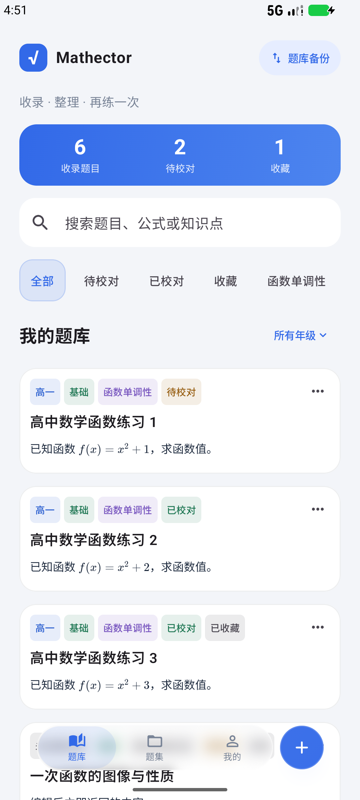
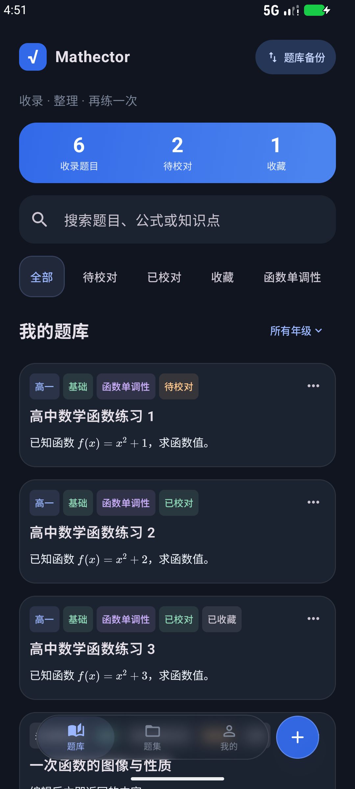
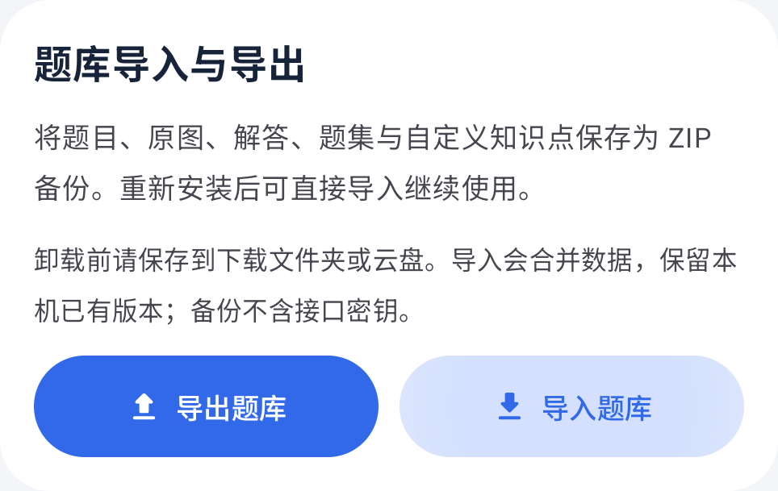
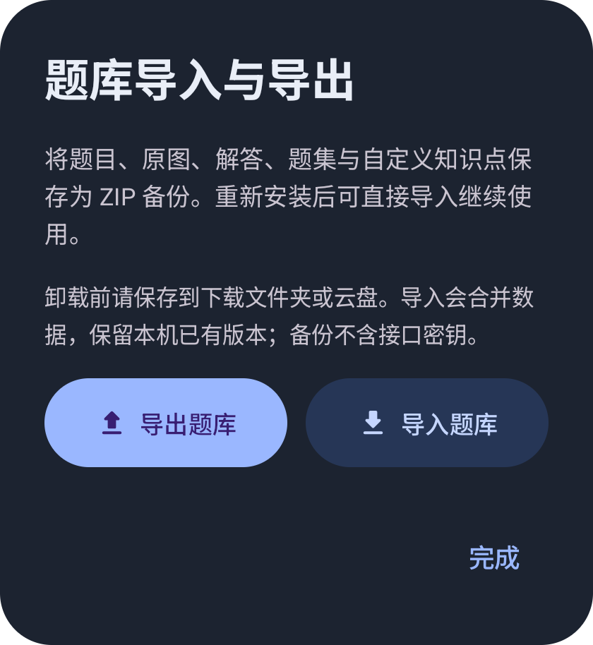

# Mathector

一款面向高中数学的原生 Android 题集 App。把拍照、相册图片或 PDF 中的题目识别为可校对的题干，按知识点整理，组合成题集，再导出练习文档。

**当前版本：0.21.0 · 最低 Android 8.0 · 中文界面**

[下载 Android APK](https://github.com/SACO1F/Mathector/releases/download/v0.21.0/Mathector-0.21.0-debug.apk) · [版本说明与校验文件](https://github.com/SACO1F/Mathector/releases/tag/v0.21.0) · [题库备份说明](docs/library-backup.md) · [开发与验证历史](docs/development-history.md)

## 安装与快速开始

1. 下载并安装 APK。当前提供 Debug 构建；0.21.0 与上一版签名相同，可以覆盖安装并保留本地数据。
2. 首次打开可点击“先用 3 道示例题体验”，或使用右下角加号手动录入题目。
3. 需要图片或 PDF 识别时，在“我的 → 题目识别与接口”填写接口地址、API Key、支持图片输入的模型名，保存后点击“测试图片识别”。
4. 拍照、选择相册图片或导入图片／PDF；识别完成后打开待校对题目，对照原图修改题干和分类，明确确认已校对。
5. 在“题集”创建题集，分类选择题目，调整顺序与文档设置，再导出 PDF 或 Word。

手动录入、示例体验、本地整理、公式显示和文档导出可离线使用。图片／PDF 识别与 AI 解题需要联网并配置接口。

## 核心功能

| 功能 | 当前能力 |
| --- | --- |
| 题目录入 | CameraX 拍照、相册多选、图片／PDF 导入、手动录入；图片与 PDF 页面统一通过多模态接口识别 |
| 高中分类 | 年级仅含高一、高二、高三；支持题型、难度和多个知识点，内置 13 个模块、70 个知识点，可新增自定义知识点 |
| 校对与整理 | 对照原图编辑，明确区分待校对／已校对，支持收藏与检索；题库、选题和题集使用标签前置的紧凑卡片 |
| 分类选题 | 知识点、年级、难度与关键词组合筛选，跨筛选保留选择，批量加入题集并去重 |
| 题集管理 | 创建、排序、移除及删除题集；删除题集保留题库原题，列表和详情均可导出 |
| 公式与解题 | 本地 KaTeX 显示题干和 AI 解答中的 LaTeX；独立公式校对预览；可选自动解题及手动生成、取消、重试 |
| 文档导出 | A4 PDF 和 DOCX，支持试卷主标题、考试说明、考试时间、满分及选择题选项排版 |
| 题库备份 | 完整 ZIP 导出与合并恢复，保留题目、可用原图、解答、自定义知识点、题集顺序与文档设置 |
| 外观动效 | 白天／黑夜／跟随系统主题，蓝色点缀、玻璃悬浮导航、滑动切换、按压回弹和圆角弹窗；题集与校对／录入顶部固定 |

## 界面预览

以下截图来自 0.21.0，使用应用示例和临时测试题目。

| 白天题库 | 黑夜题库 |
| --- | --- |
|  |  |

| 我的页面 | 题库备份窗口 |
| --- | --- |
|  |  |

## 配置识别接口

目前接入 **OpenAI 兼容的 Chat Completions 视觉协议**。服务商、地址、API Key 和模型名由用户自行填写，模型必须支持图片输入。第三方服务是否兼容，请通过内置图片测试验证。

| 地址填写方式 | 实际请求路径 |
| --- | --- |
| `https://vision.example.invalid` | `/v1/chat/completions` |
| `https://vision.example.invalid/v1` | `/v1/chat/completions` |
| `https://vision.example.invalid/custom` | `/custom/chat/completions` |
| 完整 HTTPS 地址，以 `/chat/completions` 结尾 | 使用该地址 |

上表域名仅用于展示规则。地址必须使用 HTTPS，不能包含账号、查询参数或片段。仅提供 Responses、Gemini 原生或私有协议的服务需要增加适配器。

图片修正方向、压缩后作为图像输入发送，最长边不超过 2000 像素；PDF 先逐页渲染成图片，再通过相同接口识别。没有离线 OCR 入口。单个导入文件不超过 **50 MB**，单份 PDF 最多 **20 页**。

结果先保存为待校对草稿，分类为可修改的建议。后台任务支持重试、复用成功页面并保留人工修改。年级仅限三个高中年级，知识点建议只能来自内置或已保存的自定义高中词表。

## 校对、公式与解题

- **校对状态**：显式确认后才标为已校对。修改标题、题干或分类后需重新确认；修改独立公式或解题设置不会改变校对状态。空题干不能确认已校对。
- **公式原位显示**：题库、选题、题集、编辑预览和 AI 解答支持文字与公式混排。推荐 `\( ... \)` 或 `\[ ... \]`，同时兼容 `$...$` 和 `$$...$$`。
- **独立公式仅用于校对**：该字段有专用 LaTeX 预览，不追加到题库卡片或题干预览，不参与练习导出。需要导出的公式应写在题干相应位置。
- **知识点可增删**：校对页点击“添加知识点 +”选择多个标签，点击已选标签移除；知识库右上角加号可在高中模块下新增知识点并选中。
- **AI 解答需核对**：自动解题默认关闭，也可针对单题手动生成。答案保存为“AI 解答 · 待核对”，不会自动确认题目已校对或加入练习文档。题干变化使旧解答失效，后台写回检查内容指纹。

识别、图片测试和解题会调用所配置的服务，可能产生服务费用。

## 题集与文档导出

从“题集 → 打开题集 → 添加题目”进入分类选题。知识点、年级、难度与关键词可组合筛选，跨筛选保留选择，确认后按选择顺序加入。题目卡片右上角菜单支持上移、下移和移除。

每个题集独立保存“文档设置”：试卷主标题、考试说明、考试时间和满分。主标题默认使用题集名，清空即可隐藏，其他字段不填则不输出。标题最多 80 字，说明最多 600 字；时间为 1–999 分钟，满分为 1–9999 分。

导出按选题顺序生成大题编号，输出填写的试卷信息、题干与子题。多个小题标为 `（1）`、`（2）`，每道题重新起算；题目标题、分类标签、独立公式、AI 解答和原图附录不输出。题干 LaTeX 由离线 KaTeX 渲染后嵌入。

完整 A/B/C/D 选项能放入一行时横向展开，超过可用宽度时按 A/B、C/D 两行两列排版，长选项在各自列内换行。PDF 与 DOCX 使用相同宽度决策。Word 正文可以编辑，公式目前为图片，尚不支持 OMML 可编辑公式。

## 题库备份与卸载后恢复

**卸载前，将完整题库 ZIP 保存到下载文件夹、其他公共文件目录或云盘。**

1. 点击题库右上角“题库备份”，或进入“我的 → 题库导入与导出”。
2. 点击“导出题库”，通过系统文件选择器保存 ZIP，确认成功并保留文件。
3. 重新安装后点击“导入题库”，选择之前导出的 ZIP，查看数量预览后确认导入。
4. 需要继续识别或解题时，重新填写接口配置。

| 数据 | 是否备份 |
| --- | --- |
| 题目标题、题干、子题、独立公式、分类、收藏和校对状态 | 是 |
| 已有 AI 解答及单题自动解题开关 | 是；恢复不会启动解题任务 |
| 仍可读取的原图 | 是；按内容去重，恢复到新的本机路径 |
| 题集、选题顺序、试卷信息、自定义知识点 | 是 |
| API 地址、模型名、API Key、主题与全局自动解题偏好 | 否 |
| 后台任务队列与导入记录 | 否 |

导入采用合并：同编号题目与题集保留本机已有版本，重复导入不会重复添加；新题集可以关联已有题目。导入前校验格式、版本、路径、关联与原图哈希，取消预览不写入数据，恢复失败回滚本次新增内容。原图在导出前已缺失时会提示，题干和其他内容仍可备份。

ZIP 用于恢复题库，PDF／Word 用于练习与打印。当前为手动备份，没有账户或自动云同步。格式、数量和大小限制见 [题库备份说明](docs/library-backup.md)。

## 数据与隐私

题目和题集保存在本机 Room 数据库，原图保存在应用私有目录。卸载会删除这些本地数据，使用上方 ZIP 备份流程可保留资料。

识别向用户配置的服务发送题目图片；解题发送题目内容，并在可用时使用原图补充信息。API Key 使用 Android Keystore 的 AES-GCM 加密保存，不回填已保存的明文，不进入题库备份、任务输入或题目数据库，可在设置页清除。

应用不请求全盘存储或跨应用悬浮窗权限。悬浮栏与按钮位于应用内，系统时间、电量状态栏的实际高度由 Android 管理。

## 开发与构建

主要技术：Kotlin、Jetpack Compose、Room、WorkManager、CameraX、OkHttp、Coil、Haze 和本地 KaTeX。

| 配置 | 当前值 |
| --- | --- |
| Android SDK | compileSdk / targetSdk 37，minSdk 26 |
| Android Gradle Plugin / Gradle Wrapper | 9.4.0 / 9.7.1 |
| Compose 编译器插件 / KSP | 2.3.21 / 2.3.6 |
| 本机验证 JDK | Android Studio 内置 JBR 25 |
| 数据库版本 | 4，保留版本 1、2、3 的迁移路径 |

使用 Android Studio 打开项目，安装 Android SDK 37 与 Platform Tools。SDK 路径由本机 `local.properties` 配置，该文件不提交；JDK 路径按本机安装位置调整。

```powershell
$env:JAVA_HOME = 'C:\Program Files\Android\Android Studio\jbr'
.\gradlew.bat :app:assembleDebug :app:testDebugUnitTest :app:assembleDebugAndroidTest :app:lintDebug --console=plain
```

输出：应用包 `app/build/outputs/apk/debug/app-debug.apk`，测试包 `app/build/outputs/apk/androidTest/debug/app-debug-androidTest.apk`。Wrapper 使用腾讯公共分发镜像并配置官方 SHA-256，依赖从 Google Maven 与 Maven Central 解析。

设备验证建议使用专门的测试模拟器。下面对 `emulator-5554` 执行题库备份专项，需要把 `adb` 加入 PATH，或使用 SDK 下的 `platform-tools/adb.exe` 完整路径：

```powershell
adb -s emulator-5554 install -r app/build/outputs/apk/debug/app-debug.apk
adb -s emulator-5554 install -r app/build/outputs/apk/androidTest/debug/app-debug-androidTest.apk
adb -s emulator-5554 shell am instrument -w -e class com.mathector.app.LibraryBackupTest com.mathector.app.test/androidx.test.runner.AndroidJUnitRunner
```

## 最新验证范围

0.21.0 于 **2026-10-08** 完成构建，**39 项单元测试**通过，Lint 为 **0 错误、20 项既有警告**。设备测试覆盖 **7 个独立场景**，两轮共执行 8 项检查，全部通过。

覆盖独立空数据库模拟重装、原图与解答恢复、题集顺序和文档设置、合并与重复导入、取消、损坏文件拒绝、恢复失败回滚、空库及缺失原图，以及两种主题的统计卡片高度、等宽和居中。文件选择合约使用受控 URI 与返回值，未验证实际云盘服务。APK 签名及发布文件校验通过，详见 [0.21.0 发布说明](docs/releases/0.21.0.md)。

尚未验证真实服务商的识别准确率。复杂公式、跨栏与跨页拆题需要人工校对，几何图目前保留来源整页；Android 8.0、厂商真机、平板、拍摄质量与性能矩阵仍需扩大验证。DOCX 已验证结构与公式图片，尚未完成 Word／WPS 编辑与打印验证。

## 代码与文档导航

| 入口 | 内容 |
| --- | --- |
| [Compose 界面](app/src/main/java/com/mathector/app/ui/) | 题库、校对、题集、选题、主题与圆角弹层 |
| [AppViewModel](app/src/main/java/com/mathector/app/AppViewModel.kt) | 页面操作、任务调度和题库备份状态 |
| [数据层](app/src/main/java/com/mathector/app/data/) | Room、分类、识别、解题、公式与文档生成 |
| [多模态识别](app/src/main/java/com/mathector/app/data/MultimodalRecognitionEngine.kt) | 视觉请求、图片处理与响应解析 |
| [接口存储](app/src/main/java/com/mathector/app/data/SettingsStore.kt) | 主题、地址校验与密钥加密 |
| [高中知识库](app/src/main/java/com/mathector/app/data/KnowledgeCatalog.kt) | 内置词表与分类校验 |
| [题库备份服务](app/src/main/java/com/mathector/app/data/LibraryBackupService.kt) | ZIP 导出、校验与合并恢复 |
| [文档导出](app/src/main/java/com/mathector/app/data/DocumentExporter.kt) | 试卷首页、正文公式与选项布局 |
| [单元测试](app/src/test/java/com/mathector/app/) / [设备测试](app/src/androidTest/java/com/mathector/app/) | 数据、迁移、界面与导出验证 |
| [产品方案](docs/product-plan.md) / [备份说明](docs/library-backup.md) | 产品进度、备份流程与格式限制 |
| [版本记录](docs/releases/) / [开发历史](docs/development-history.md) | 发布说明、历史改动与验证证据 |

仓库包含源码、Gradle Wrapper、数据库 schema、测试和公开示例截图。本机配置、密钥、构建缓存、临时题库备份和验证产物不提交；APK 与校验文件通过 GitHub Release 提供。

KaTeX 使用 MIT 许可，原文保留在 [本地资源目录](app/src/main/assets/katex/LICENSE)。正式发布前还需汇总应用内开源声明，补充无障碍、批量管理和发布验证。
