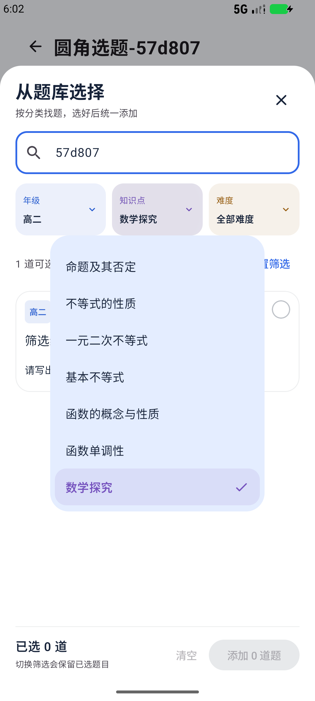
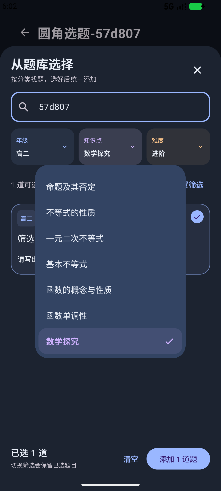

# Mathector Android

高中数学题集 Android 原生工程，最低 Android 8.0。当前交付为 0.17.0，支持用户配置的多模态识别、高中内置与自定义知识库、标签增删、弹性分类按钮、可选自动解题、正文 LaTeX 排版、分类选题、题库／题集／选题统一紧凑卡片、滑动悬浮导航、选题面板下滑收回、无阴影圆角气泡、Apple 风格创建／删除题集弹窗、微透明蓝色添加按钮和加号、统一题集操作按钮、紧凑文档设置、题集列表直接导出，以及识别与接口配置合并卡片。

[公开仓库](https://github.com/SACO1F/Mathector) · [下载 0.17.0 APK](https://github.com/SACO1F/Mathector/releases/download/v0.17.0/Mathector-0.17.0-debug.apk) · [版本说明](https://github.com/SACO1F/Mathector/releases/tag/v0.17.0)

本地安装包位于 artifacts/Mathector-0.17.0-debug.apk。Git 仓库包含源码、Gradle Wrapper、数据库迁移 schema 和测试；本机配置、密钥文件、构建缓存、临时文件与历史验证产物不提交。历史 artifacts 验证记录在开发机保留，当前版本安装包和校验文件通过 GitHub Release 提供。

## 已实现

- Compose 题库、题目校对、题集与任务记录。
- CameraX 拍照、系统相册多选、图片/PDF 文件导入。
- 图片与 PDF 页面只使用可配置的多模态视觉接口提取题干和 LaTeX，并建议年级、题型、难度和知识点；应用不再包含离线文字识别入口、引擎或模型。
- 模型分类建议允许人工修改，手动录入也可依据本地分类规则给出建议；导入结果进入待校对草稿。
- Room 持久化、WorkManager 后台导入与重试，重试保留人工修改。
- 本地 KaTeX 公式预览；题库卡片、题干预览和 AI 解答支持文字与行内／独立公式混排。分数、根号、平方快捷输入。
- 题集排序、去重加入、收藏、关键词与年级筛选；从题库添加题目支持知识点、年级、难度组合筛选和跨筛选批量选择。
- A4 PDF 和 DOCX 保存/分享，支持试卷主标题、考试说明、考试时间、满分；按选题顺序导出编号、题干与子题，多个小题按（1）（2）排序，正文中的公式由离线 KaTeX 渲染后嵌入。原图在校对页查看。
- 应用内玻璃悬浮导航、按压回弹、跟随系统／白天／黑夜主题；主题选择持久保存，系统栏图标同步调整明暗。
- 悬浮导航高度 52 dp、添加按钮 50 dp、导航点击区域至少 48 dp，任务状态胶囊同步缩小。
- API Key 使用 Android Keystore 的 AES-GCM 加密保存，界面不回填已保存的明文 Key；可清除配置中的 Key。
- 内置 13 个模块、70 个高中数学知识点；可在知识库右上角新增自定义知识点，选择所属高中模块后本地保存。一个题目可以有多个标签，通过“添加知识点”搜索或按模块选择；点击已选标签移除。内置与已保存的自定义标签均可用于识别建议、题库和选题筛选，未注册的标签被过滤。
- 年级只允许高一、高二、高三；年级与难度采用滑动高亮分段按钮，题型采用胶囊按钮，带按压缩放、颜色过渡和弹簧回弹。
- 可选导入后自动解题，默认关闭；每道题也有自动解题开关、手动生成、取消和失败重试入口。解答包含答案、分步推导和关键公式，保存后仍显示“AI 解答 · 待核对”。

## 高中分类与自动解题

知识库覆盖集合与逻辑、不等式、函数、三角、平面向量、复数、立体几何、解析几何、数列、导数、计数原理、概率统计、数学活动。不绑定特定教材或固定年级教学进度；自定义知识点归入这 13 个高中模块。模型只能选择当前知识库中的标签，无法自行新增标签。无法确定年级时保留未选择状态，用户从三个高中年级中指定。

在题目校对页的“知识点”卡片点击“添加知识点 +”，从知识库选择多个标签；点击已选标签或其叉号可以移除。年级、题型和难度都是单选，知识点允许多选。

知识库右上角的加号打开圆角新增窗口。填写知识点名称、选择所属模块，再点击“添加并选中”，即保存并应用于当前题目。名称最多 32 个字符，不能包含换行或分类分隔符；内置名称、别名及重复自定义名称会提示直接选择现有知识点。自定义知识点保存于独立本地偏好，应用启动及后台处理题目前加载，重启后可继续选择。题库和选题筛选会展示题目实际使用的标签；每次多模态识别请求使用最新知识库。

在添加题目的面板或“我的”中开启“导入后自动解题”，会在识别完成后调度独立的后台解题任务。该设置默认关闭，不影响拍照／相册／PDF 识别。单题可以启用“自动解题”，也可以在关闭时手动点击“生成解答”。

解题使用当前配置的 Chat Completions 模型；优先依据人工校对后的题干与公式，来源图片用于补充几何图信息。需要网络连接，可能产生额外服务费用。解答会保存到题目中，但不会自动确认题目已校对，也不会自动加入练习 PDF/DOCX。

取消任务会取消正在进行的网络请求。题干、标题、公式或来源发生变化时，旧解答失效；后台写回前会再次比对题目内容指纹，避免旧请求覆盖新题干。开关开启时，内容修改保存后重新生成；接口错误可重试，缺少条件的题目应由模型说明缺失条件。

数据库由版本 1 升级到版本 2，保留原有题干、原图路径、收藏和题集关系。旧版非高中年级清空为未设置；知识点规范化为内置高中词表，无法映射的标签移除，已选高中标签保留。升级不会清空题库，已有题目不会自动开启解题。

## 0.4.0 正文公式与导出

知识库面板使用固定视口高度，关闭面板拖动与列表边界拉伸，让知识列表独立滚动。标签预留选中图标空间，选择时不改变网格宽度；按压缩放与颜色过渡保留。

识别接口要求题干、答案和步骤中的每个公式在原位置使用 `\( ... \)`／`\[ ... \]`；显示端也兼容 `$...$`／`$$...$$`。旧版常见表达式（如 `f(x)=x²`、`a₁=2`）会转换为 LaTeX 显示；复杂的无分隔符旧文本仍建议在校对页补全 LaTeX。文字经过 HTML 转义，KaTeX 禁止可信命令，渲染器仅访问应用内资源。

0.4.0 的识别、保存和旧数据升级移除标题、题干及子题的行首题号，子题保持分行；0.7.0 改为移除原大题题号，多个小题重新编为 `（1）`、`（2）`。保留小数、区间、数学下标与 A/B/C/D 选项标记。仅因编号整理而改变的内容会同步有效解答指纹，保留已有答案、收藏和题集关系。

PDF/DOCX 按选题顺序生成 `1.`、`2.` 等编号并排版题干与子题；0.7.0 可在首页添加用户填写的试卷信息。题目标题、年级、知识点、来源附录、答案、姓名日期及页眉页脚均不输出。从 0.6.0 起，导出与预览统一以题干为准，不再把独立公式字段补到题干后面；仅在没有题干的纯公式题目中使用该字段。Word 的文字可编辑，公式以 KaTeX 生成的 PNG 随正文排列，尚不支持 OMML 编辑。

## 0.5.0 预览与选择题选项

题库卡片和编辑页“题目预览”只显示题干中的公式，不自动追加独立公式字段；编辑页也不再另设独立公式展示卡片。仅在没有题干的纯公式草稿中，将独立公式作为唯一预览内容。原有字段仍可编辑，题干原位置的公式继续由 KaTeX 渲染。

导出时，对选择题识别完整且按顺序出现的 A/B/C/D 标签，兼容点号、顿号、冒号、括号和全角字母；LaTeX 内部的字母标签不参与拆分。四项连同标签、公式和必要间距能够放入 A4 单栏宽度时，用一行横向展开；超过可用宽度时，按 A/B 和 C/D 两行、两列排版。较长的选项在自己的列内换行，超长选项跨页时保留后续内容。PDF 和 DOCX 使用相同的宽度决策，Word 使用无边框表格维持选项布局。

公式仍在选项中原位排版，不额外打印答案或分类信息。不完整或无法可靠识别的选项标签保留原文，避免丢失选项。

## 0.6.0 导出修复与单一识别方式

PDF 和 Word 均停止追加独立公式字段，解决公式在题干中已经出现、但不同 LaTeX 写法未被去重时又单独打印一次的问题。多模态提取提示要求全部题目公式出现在 body 的原文字位置，禁止在题干末尾重复，latex 字段固定为空；原有独立字段仍保留编辑能力。

移除 ML Kit 中文文字识别依赖、离线引擎与识别方式开关。设置页固定显示多模态识别，拍照、相册和 PDF 全部使用同一配置。升级时清除旧识别方式偏好，保留地址、模型、加密 Key 与其他设置；旧离线任务也使用多模态引擎，未配置接口时显示失败原因。新增任务统一等待联网，重试继续复用已成功页面并保留人工修改。

底部悬浮栏的玻璃底色不透明度由 70% 调整为白天 28%、黑夜 32%，模糊半径从 16 dp 调整为 12 dp，并减淡边框。不支持背景模糊时使用白天 40%、黑夜 48% 的半透明底色。蓝色选中状态、图标与点击区域保留。

## 0.7.0 试卷信息与小题编号

题库上方的“全部”“待校对”“收藏”和知识点筛选按钮移除对号和图标占位，保留蓝色选中背景、颜色过渡与按压回弹；知识库中的标签选择和删除图标保留。

打开“题集 → 任意题集 → 文档设置”，填写试卷主标题、考试说明、考试时间（分钟）和满分。每个题集独立保存这些设置；主标题默认使用题集名，清空即可隐藏。其他字段默认空白，不填则不输出。主标题最多 80 字，考试说明最多 600 字，支持换行；考试时间为 1-999 分钟，满分为 1-9999 分。输入无效时显示提示并禁用导出。点击导出会先保存本次设置，确保 PDF/DOCX 使用刚输入的内容。

PDF 和 Word 首页显示居中的试卷主标题，以及考试时间／满分一行，随后排版考试说明和题目；后续页不重复这些信息。每道题仍按选题顺序标注大题编号，多个小题按 `（1）`、`（2）` 连续编号，每道题重新起算。无小题或只有一个小题时不增加小题编号。

多模态提取使用 `subquestions` 数组保存当前题目的小题顺序，随后合入题干并统一编号。旧题优先使用已有的括号或圈号标记；标记已经被旧版清理时，仅对题干之后明确分行的“求／证明／判断”等提问补编号。无法判断边界的旧文本可在校对页将每个小题分行并添加括号编号，保存后自动整理。显式 LaTeX 内部的编号不参与题号清理。

数据库版本 3 升级到 4 时为题集增加四个试卷字段，旧题集主标题默认使用原题集名，已有题目、题集顺序、收藏和有效解答保留。

## 0.8.0 分类选题与彩色标签

在“题集 → 打开题集 → 添加题目”中使用选题面板。三个下拉分类支持组合筛选，例如“高二 + 数列求和 + 进阶”；知识点筛选匹配题目任意一个已标注知识点，下拉列表展示当前可添加题目使用的内置高中知识点。年级、知识点和难度各自可恢复“全部”，也可以一键重置所有条件。支持按题目标题、题干、公式或知识点搜索，搜索与分类筛选同时生效。

每张选题卡片显示标题、年级、难度、全部已标注知识点与题干 LaTeX 预览。年级为蓝色标签，知识点为紫色标签，基础／进阶／挑战分别为绿／橙／红色标签；未设置年级、未标注知识点、待评估和待校对用灰色标签。白天与黑夜主题使用对应的文字颜色和浅色块。

点击卡片选择或取消选择，跨筛选条件保留已选题目，底部显示总数量；点击“添加 N 道题”后统一加入，按选择顺序接在当前题集后面。已在题集中的题目不再显示，批量写入会跳过重复或已删除的题目。点击“清空”只取消已选题目，“重置筛选”只清除筛选条件；关闭面板则放弃本次未确认的选择。没有结果时显示空状态，可减少筛选条件继续查找。

## 0.9.0 紧凑卡片与题集悬浮入口

选题面板与题集共用题目卡片：最上方显示年级、难度和全部知识点，再显示题目标题与具体题干的 LaTeX 预览。标签字号、内边距和间距缩小，常用分类在一行排列，知识点较多时自然换行；待校对和未分类状态保留灰色标签。题干较长时显示预览，点击题集卡片可打开完整校对页面。

题集卡片右上角的“题目操作”菜单支持上移、下移和从题集移除；位于首尾的题目禁用对应方向，不删除题库原题。原来的顶部添加按钮移动到右下角，采用 52 dp 高的透明玻璃胶囊，蓝色加号与文字、背景模糊、淡边框、轻阴影和按压回弹。按钮独立于滚动列表固定显示，并避开系统导航栏；列表底部留出空白，滚动到底后导出按钮完整可见。

## 0.10.0 题库统一卡片与滑动动效

“我的题库”也使用标签前置的共享卡片，显示年级、难度、全部知识点、标题与 LaTeX 题干预览；示例、待校对与收藏状态用紧凑标签保留。移除旧卡片的底部分隔线和操作行，缩小内边距、标题字号和卡片间距。收藏／取消收藏与加入题集位于右上角“题目操作”菜单；点击题干和公式区域仍打开完整校对页面。

底部 52 dp 玻璃导航使用单个滑动选中背景，切换题库／题集／我的时以弹簧动画移动，可在运动中连续切换或反向选择。图标与文字颜色渐变，点击有轻微回弹；页面按切换方向以相同速度同步横向滑动，配合淡入淡出，导航条本身保持固定。

从题库选题时，点击右上角叉号先清除输入焦点、收起键盘，再等待面板下滑隐藏完成后关闭。动画期间禁用叉号和确认按钮，避免重复操作；关闭不保存未确认选择。确认添加也等待收回动效完成后提交本次选中的题目，外部点击与系统返回继续使用底部面板的原生关闭流程。固定高度、关闭手势拖拽与列表边界滚动设置保留。

## 0.11.0 圆角菜单与创建题集弹窗

题库与题集右上角的题目操作菜单共用 24 dp 圆角气泡，带轻阴影、细边框、宽松留白、右侧操作图标和分隔线。点击反馈为柔和背景变化与轻微弹簧缩放；题集移除操作标为红色，首尾题目仍禁用对应方向。菜单沿用 Android 原生弹出定位、打开／收回动画、外部点击与系统返回关闭。

题库右侧年级菜单使用同一气泡，保留所有年级、高一、高二、高三。当前年级显示浅蓝圆角高亮和蓝色标记，选择后立即筛选并收回。

创建题集改为 30 dp 圆角居中弹窗，包含蓝色文件夹图标、说明、16 dp 圆角输入框，以及并排的取消／创建按钮。空名称或纯空格禁用创建；支持键盘“完成”确认，保存时去除名称首尾空格。三类弹层均适配白天／黑夜主题。

## 0.12.0 紧凑设置与题集列表导出

题集右下角的“添加题目”改为蓝底白字，保留 52 dp 悬浮胶囊、轻阴影、按压回弹和避开系统导航栏的位置。文档设置的内边距从 18 dp 收到 14 dp，字段间距从 12 dp 收到 6 dp；标题与自动保存说明放在同一行。普通状态不再预留空的错误说明行，时间／满分的单位移入输入框，考试说明按内容展开，错误提示与自动保存保持可用。

题集列表每张卡片右侧增加“导出”按钮，点开圆角菜单选择 PDF 或 Word，使用已保存的试卷信息与当前选题顺序。题集描述只显示题目数量。空题集禁用导出，正在排版时防止重复启动并在对应按钮显示进度；有待校对题目时，可继续导出或打开题集校对。列表与详情共用生成、保存和分享流程。

“我的”页面将题目识别说明与地址、模型名、API Key 合为一张“题目识别与接口”卡片，保存与图片测试按钮并排显示。卡片内边距和间距同步缩小，保留配置保存、加密密钥、留空保留密钥、清除及图片识别测试功能。

## 0.13.0 统一操作与自定义知识点

题集列表的“删除”和“导出”共用圆角浅蓝按钮，图标尺寸、文字、内边距与高度一致；删除仍需确认，删除题集保留题库中的原题。题集内右下角“添加题目”保留白色图标和文字，蓝色底色不透明度改为 78%，增加淡边框，保持按压回弹与固定位置。

题型胶囊移除对号及其占位，每项减少 20 dp 宽度；选中状态继续通过蓝色文字、浅蓝背景和边框表达，选择时不改变宽度。知识库的多选标记与已选知识点的移除图标保留。

高中知识库右上角新增加号入口，圆角窗口支持选择高中模块、填写名称和“添加并选中”。自定义词表先写入本地再应用到题目；重载时过滤无效模块、重复名称和分隔符，保留 70 个内置知识点。题目保存、标签显示、题库筛选、从题库选题及多模态请求共用最新词表，无需升级题目数据库。

## 0.14.0 浅蓝毛玻璃与题集底部修整

题集右下角“添加题目”改为浅蓝毛玻璃胶囊：独立捕获滚动列表作为背景，使用 20 dp 模糊、轻微噪点、渐变高光、淡边框和柔和阴影。深蓝加号和文字与浅色玻璃底搭配；保留 52 dp 高度、按压回弹和系统导航安全间距。白天／黑夜分别调整玻璃底色，不支持实时模糊的设备使用浅蓝半透明底色回退。

题集列表不再在整个视口外侧添加底部导航留白，滚动区域延伸至窗口底部；导航安全间距加入列表内部的末尾留白，确保最后的文档设置和导出按钮完整显示。系统导航区采用透明底色，Android 10 及以上关闭额外的导航对比度色块，应用继续调整手势／导航图标的明暗。

## 0.15.0 统一毛玻璃按钮与选题气泡

题集内“添加题目”和主界面右下角加号共用玻璃表面：分别捕获背后的列表／主页面，24 dp 背景模糊、轻微噪点、渐变高光、细边框与柔和阴影。降低蓝色覆盖层不透明度，白天使用浅蓝玻璃与深蓝文字，黑夜使用蓝色玻璃与浅色文字；保留按压回弹、题集按钮 52 dp 高度、主页面加号 50 dp 触摸区，以及系统导航安全间距。不支持实时模糊的设备使用适配主题的半透明底色回退。

从题库选择中的年级、知识点、难度气泡统一复用 Apple 风格菜单：24 dp 外圆角、15 dp 选项圆角、淡边框、柔和阴影和按压回弹。选中行保留年级蓝、知识点紫、难度橙的分类色；“全部”与具体选项以细分隔线区分。知识点菜单加宽、对齐筛选按钮中心并保留滚动，按窗口宽度限制尺寸、保留边缘留白，适配较长名称。组合筛选、跨筛选保留选择、未分类选项、返回键关闭气泡，以及关闭选题时下滑收回的行为继续保留。

## 0.16.0 无阴影气泡与蓝色按钮

统一移除圆角气泡的外阴影和外描边，覆盖从题库选择的年级／知识点／难度、题集内题目上移／下移／移除、题库年级、题库题目右上角操作，以及题集导出格式菜单。白天使用淡灰蓝底，黑夜使用略亮于页面的深色底，使没有阴影的圆角仍清晰可辨。保留 24 dp 外圆角、选项圆角、分类色、按压反馈和原生打开／关闭动画；知识点气泡继续居中、保留边缘留白及滚动。

删除题集改为 28 dp 圆角居中确认弹窗，显示题集名称与“题库中的题目会保留。”说明，底部蓝色取消／红色删除按钮等宽排列，使用细分隔线。取消、返回和点击外部仅关闭弹窗；确认删除题集及其排序关系，保留题库原题。

题集内“添加题目”和主界面圆形加号恢复统一的原蓝色 #3269E8，底色不透明度为 96%，白色文字和图标。仅保留轻微透明、高光与背景模糊，保留按压回弹、固定位置和导航安全间距。

## 0.17.0 气泡配色与公开仓库

所有共用圆角气泡统一使用独立底色，白天为浅蓝色 #E4EDFF，黑夜为灰蓝色 #334463，与页面、白色卡片和深色选题面板形成明显色差。继续使用无外阴影、无外描边的 24 dp 圆角样式；默认选中蓝色在白天下调整为 #285DCF，以保持文字可读。年级蓝、知识点紫、难度橙的分类色和气泡开合行为保留。此配色同时覆盖题库、选题、题集排序、导出和自定义知识点模块菜单。

工程以 Mathector 同名公开仓库发布，安装包通过 Release 提供。克隆后使用 Android Studio 打开根目录，由本机生成 local.properties；API 地址、模型名和 Key 在 App 内配置。

| 白天气泡 | 黑夜气泡 |
| --- | --- |
|  |  |

## 配置多模态识别

打开“我的 → 题目识别与接口”，自行填写 HTTPS 地址、API Key 和支持图片输入的模型名，点击“保存接口配置”，再点击“测试图片识别”。测试使用应用内置的数学题图片，会调用所填服务，可能产生服务费用；没有填写配置时不能开始多模态导入。

目前适配 OpenAI 兼容的 Chat Completions 视觉协议。基础域名会补全 /v1/chat/completions；以 /v1 或其他路径结束的基础地址会追加 /chat/completions；也可以直接填写完整 /chat/completions 地址。仅支持 HTTPS，不接受地址中的账号、查询参数或片段；不跟随重定向。仅提供 Responses、Gemini 原生或其他私有协议的服务需要另加适配器。

图片按方向修正后转为 JPEG，最长边不超过 2000 像素，以 Base64 图像输入发送；PDF 先逐页栅格化，再通过同一视觉接口识别。请求不流式输出，不强制服务商特有的参数。成功响应按题目结构解析，保留公式与分类建议；认证失败、地址或模型错误、额度或限流、截断、空题目和无效结构均显示具体提示。

资料仍保存在本机，识别请求的图片内容发送至用户配置的服务。云识别任务等待网络连接。成功页的题目结果保存在应用私有缓存，重试复用成功页，仅重新请求失败页，不覆盖已保存的人工修改。API Key 不进入 WorkManager 输入、数据库、构建脚本、日志或题目结果缓存。

“我的 → 题目识别与接口”固定使用多模态识别，填写地址、API Key、模型名并保存后才能导入识别。选择“黑白模式 → 白天／黑夜／跟随系统”可切换外观。

## 当前边界

多模态模型的实际能力取决于服务商与所选模型；当前没有配置真实服务，未验证供应商识别准确率。复杂公式、跨栏与跨页拆题需要对照原图校对；几何图暂保留来源整页。单个文件限制 50 MB，每个 PDF 最多 20 页。年级、难度和知识点是待确认的建议。

DOCX 的正文可以编辑，行内及独立公式是本地渲染的图片，尚未生成 OMML 可编辑公式。账户与跨设备同步尚未接入。题目保存在应用私有数据库，卸载会删除本地资料。系统时间／电量栏的实际高度由 Android 管理，本次缩小的是应用内悬浮导航和任务状态胶囊。生产上线前还需补充备份、完整无障碍、平板与厂商真机矩阵、批量管理和安全审计。

## 构建

使用 Android Studio 打开本目录，安装 Android SDK 37.0，选用兼容 Gradle 9.7.1 的 JDK（本机使用 Android Studio 内置 JBR 25）。

```powershell
$env:JAVA_HOME = 'C:\Program Files\Android\Android Studio\jbr'
.\gradlew.bat :app:assembleDebug :app:testDebugUnitTest
.\scripts\test-device.ps1
.\gradlew.bat :app:lintDebug
```

本机 SDK 路径配置在被忽略的 local.properties。其他机器应由 Android Studio 自动创建自己的 local.properties。设备测试需要先启动一个模拟器或连接一台已授权调试的 Android 设备。

test-device.ps1 使用 adb 直接执行 AndroidJUnitRunner，并检查测试结果。当前机器的 Gradle UTP 设备启动阶段出现过 adb 服务连接超时，因此使用该脚本作为可重复的设备测试入口。该脚本不会清空应用数据；建议使用专门的测试模拟器。

Gradle Wrapper 使用腾讯公共分发镜像，校验值采用 Gradle 官方发布的 SHA-256。依赖仍从 Google Maven 与 Maven Central 解析。

APK 位于 app/build/outputs/apk/debug/app-debug.apk。工程不包含真实服务密钥，不请求全盘存储或跨应用悬浮窗权限。公式排版资源随应用打包；题目识别只使用多模态接口，需要自行配置并连接网络。

## 0.7.0 验证记录（2026-10-06）

- Debug APK 构建通过，已在本机 Android 17 模拟器安装并运行。
- 23 项单元测试通过：分类与拆题、题号清理／数值保留、小题顺序和重复整理稳定性、显式 LaTeX 内部编号保留、试卷设置边界与格式、四种 LaTeX 分隔符、旧文本转换与解答补充公式去重、预览与导出不追加独立公式、选项标签拆分和一行／两行宽度决策。
- 27 项设备测试通过：页面／题集／多模态管线、旧离线偏好与任务升级、未配置接口时不会识别生成草稿、知识标签保存与底部连续上划位置稳定、题库／题干预览／AI 解答的 KaTeX DOM 渲染、白天与黑夜悬浮栏截图、预览不重复显示独立公式、触摸公式打开题目、题库筛选按钮操作、试卷设置自动保存与再次进入恢复、无效时间禁用导出、多模态小题数组及缓存一致性、PDF/DOCX 试卷首页与小题编号、多页试卷仅首页显示标题、对数题重复公式回归、公式图片尺寸和多页排版、选择题一行四项／两行两项及超长选项跨页完整性、解题请求／取消／旧结果保护／重试，以及版本 1→4、2→4、3→4 数据迁移和原解答保留。增加旧题集超长标题处理后，三个迁移测试再次通过。
- 多模态网络测试使用 OkHttp 模拟响应，检查实际请求体并跑通 Worker → 数据库流程，没有向真实供应商发送测试请求，也未使用真实 Key。
- lintDebug 通过，0 错误；剩余非阻断提示为依赖版本、KTX 写法及旧版备份配置建议。当前已关闭系统备份，并明确排除 Android 12+ 的云备份和设备迁移。
- 已将七份 A4 PDF（1 页试卷首页与公式样例、4 页试卷编号样例、1 页混排样例、3 页长题集、1 页选择题样例、2 页超长选项、1 页对数题回归样例）共 13 页逐页渲染检查，并检查文字和图片均在页面边距内。新试卷 PDF 与 DOCX 各包含 8 处公式和两组（1）（2）编号；对数题各包含 5 个公式图形：题干 1 个、选项 4 个，没有追加独立字段中的函数公式。选择题的一行四项和两列选项按首行文字基线对齐。导出公式图片已排除 WebView 滚动条，并验证重复渲染尺寸稳定。
- Debug APK 约 24.4 MB，已检查安装包不再含 ML Kit 文字识别模型与类；0.5.0 安装包约 68.6 MB。
- 已在模拟器走通相机权限、实时预览、拍摄、图片复制和后台生成草稿；模拟器虚拟场景不用于衡量纸面数学题识别质量。

样张为自动化验证内容，不是正式教材。DOCX 已验证 OpenXML 结构和公式图片，尚未在 Word/WPS 上完成编辑与打印验证。最低 Android 8.0、厂商真机、拍摄质量与性能矩阵仍待扩大验证。

## 0.8.0 验证记录（2026-10-06）

- Debug 构建、27 项单元测试与 lintDebug 通过，0 错误；新增单元测试覆盖分类组合、一个题目多个知识点的匹配、未分类题、搜索与分类组合、旧无效分类的显示规则。
- 本次覆盖的 9 项设备测试通过（题集与分类界面 5 项、选题 3 项、公式界面 1 项）：检查分类筛选、彩色标签、触摸 LaTeX 预览选择、跨筛选保留、空结果重置、搜索、批量添加顺序、重复与已删除题目处理、取消不写入、黑夜主题，以及已有题集操作、试卷设置、知识库边界滚动和公式渲染回归。首次运行中一项旧流程测试因搜索框和卡片同名而定位冲突，修正卡片定位后单独重跑通过；主应用代码未因此改变。
- 已检查三张模拟器完整截图：白天组合筛选、黑夜分类标签、黑夜未分类题；题干公式在原位显示，卡片和底部操作显示正常。APK 约 24.8 MB，签名验证通过。
- 当前版本仅改变选题界面与批量添加，不增加数据库字段；数据库仍为版本 4。上一个版本的导出与迁移验证记录保留在上方。

## 0.9.0 验证记录（2026-10-06）

- Debug APK、Android 测试包构建成功，27 项单元测试通过；Android Lint 为 0 错误、20 项既有警告。
- 本次覆盖的 10 项设备测试通过：题集与分类界面 5 项、选题 3 项、公式界面 1 项，以及统一卡片／悬浮入口综合验证 1 项。首次运行中新测试使用整段文本匹配断言检查公式子串而失败，修正为子串匹配后单独重跑通过；应用代码未因此改变。随后增加真实 WebView 公式渲染完成、黑夜正文颜色与临时提示消失的检查，再次通过。
- 检查标签在标题前、常用标签单行排列、选题和题集卡片高度一致、全部知识点保留、LaTeX 题干显示和点击、菜单上移／下移／移除、移除不删除原题、滚动前后悬浮按钮位置一致，以及滚动到底后的导出入口间距。
- 已逐张核对六张 0.9.0 模拟器截图：白天选题、黑夜选题、黑夜未分类状态、白天题集、黑夜题集、题集底部。题干公式与文字颜色正常，导出按钮完整显示；题集截图在公式加载及提示消失后采集。
- Mathector-0.9.0-debug.apk 为 24,837,935 字节，APK v2 签名验证通过。SHA-256 存于同名 .sha256 文件。数据库仍为版本 4。

## 0.10.0 验证记录（2026-10-06）

- Debug APK、Android 测试包构建成功，27 项单元测试通过；Android Lint 为 0 错误、20 项既有警告。导航位移动画使用布局阶段的 offset 回调，避免新增逐帧组合警告。
- 首轮 13 项设备测试全部通过：原有题集／分类 5 项、选题 3 项、公式 1 项、题集卡片 1 项，加上本次新增的题库共享卡片、导航滑动和面板收回 3 项。视觉核对后，将页面过渡改为同速同步横向移动，解决短距离淡入淡出时的文字重叠；最终 APK 的新增 3 项测试再次全部通过。
- 新增测试检查题库与题集卡片高度一致、标签位于标题之前、知识点完整、收藏／取消收藏、加入题集和公式区域点击；白天及黑夜的真实 WebView 公式与文字颜色均验证通过。
- 动效测试暂停自动时钟，检查导航高亮的中间位置、终点对齐和运动中反向切换；检查选题面板关闭时先向下移动、动画期间禁用关闭按钮、收回后移除、未确认选择不写入、重新打开清空选择，以及系统返回和打开键盘后的叉号关闭。
- 已核对题库白天／黑夜、导航滑动与终点、选题展开与收回中的完整截图，保存在 artifacts 下。APK 为 24,864,013 字节，APK v2 签名验证通过；SHA-256 存于同名 .sha256 文件，数据库仍为版本 4。

## 0.11.0 验证记录（2026-10-06）

- Debug APK 与测试包构建成功，27 项单元测试通过；Android Lint 为 0 错误、20 项既有警告。
- 本次覆盖的 16 项设备测试通过：13 项已有题集／分类、组合选题、公式、共享卡片和滑动动效回归，加上 3 项圆角弹层测试。截图核对后修正黑夜创建弹窗标题的默认文字颜色，最终 APK 上 3 项弹层测试再次全部通过。
- 弹层测试验证年级选中状态与实际筛选、返回关闭菜单、收藏／取消收藏不误开编辑器、题集上下移边界与移除保留原题；创建弹窗验证空白禁用、首尾空格清理、键盘完成确认、取消不写入、系统返回及白天／黑夜外观。最终测试增加黑夜标题实际排版颜色检查。快速重开弹窗时系统返回可能先收起尚未隐藏的键盘，测试按原生两步返回行为调整后通过；该调整未更改应用操作逻辑。
- 已核对九张白天／黑夜菜单、创建弹窗及键盘展开截图，修正后的黑夜标题清晰可读，创建和取消按钮不被键盘遮挡。截图保存在 artifacts 下。
- Mathector-0.11.0-debug.apk 为 24,892,415 字节，APK v2 签名验证通过；SHA-256 存于同名 .sha256 文件。已在 emulator-5554 覆盖安装，数据库仍为版本 4。

## 0.12.0 验证记录（2026-10-06）

- Debug APK、测试包及 lintDebug 构建通过，27 项单元测试通过；Android Lint 为 0 错误、20 项既有警告。
- 15 项设备测试全部通过：新增紧凑界面／实际列表导出／接口配置 3 项，以及原有题集／分类 5 项、选题 3 项、题集卡片 1 项和圆角弹层 3 项。
- 新测试检查空题集禁用导出、菜单不误打开详情、待校对时返回题集、继续导出、PDF 预览返回列表、实际生成 PDF 与 DOCX、保存的试卷信息与选题顺序；检查普通文档设置高度与字段间距、时间校验、说明多行保存／恢复、两个主题下按钮实际蓝色像素与白色文字，以及打开选题面板。
- 合并接口卡片测试检查单卡结构、填写保存、密钥加密、保存后输入清空、修改模型时留空保留密钥和测试按钮状态；使用虚构 .invalid 地址及测试 Key，未调用真实供应商，测试结束后恢复原有偏好。
- 已逐张核对七张白天／黑夜题集列表、格式菜单、紧凑文档设置与合并接口卡片截图。列表导出生成的一页 A4 PDF 已用 Poppler 渲染核对，主标题、说明、90 分钟、100 分、两题顺序、小题编号、一行四选项与七处公式均正常，文字和图片均在页边距内。DOCX 的保存信息、题目顺序与七个公式图片已检查；未新增 Word/WPS 打印验证。
- Mathector-0.12.0-debug.apk 为 24,903,671 字节，APK v2 签名验证通过，已在 emulator-5554 覆盖安装；SHA-256 存于同名 .sha256 文件，数据库仍为版本 4。

## 0.13.0 验证记录（2026-10-06）

- Debug APK 与测试包构建成功，30 项单元测试通过；Android Lint 为 0 错误、20 项既有警告。
- 新功能设备测试 4 项通过（35.171 秒）：删除／导出按钮的尺寸及底色一致、删除确认与保留题库原题、题型去掉图标占位后保存选项、半透明蓝色按钮与白色文字、知识点新增及重复提示、本地持久化重载、题库筛选、选题筛选及加入题集、同一识别引擎在新增知识点后使用最新提示并保留响应标签。
- 原有题库、分类、知识库边界滚动、分类选题、共享卡片和圆角菜单／创建题集弹窗共 12 项回归测试通过（99.076 秒）。最终新增流程测试等待保存提示收回后再次点击底部保存按钮；截图等待 WebView 完成主题和字体更新，避免截到过渡帧。
- 已核对白天／黑夜题集按钮、半透明添加按钮、紧凑题型、新增窗口、知识库以及自定义知识点筛选截图，保存在 artifacts 下。多模态词表更新使用拦截器构造响应验证，未新增真实服务商识别准确率测试。
- Mathector-0.13.0-debug.apk 为 24,696,873 字节，APK v2 签名验证通过，已在 emulator-5554 覆盖安装，versionCode 为 13；数据库仍为版本 4。SHA-256 为 033C213E6ACF596D51DA7A336C608CE7805F86D674F39E20346ABF4C4536B40A，存于同名 .sha256 文件。

## 0.14.0 验证记录（2026-10-06）

- Debug APK 与测试包构建成功，30 项单元测试通过；Android Lint 为 0 错误、20 项既有警告。
- 本轮 4 项设备测试通过（44.143 秒）：题集列表视口延伸到页面底部、系统导航区无额外对比度色块、悬浮按钮在滚动前后位置一致、按钮避开系统导航区、末尾 PDF／Word 按钮完整显示、文档设置保存、浅蓝玻璃与深蓝文字、选题加入及面板下滑关闭。
- 已逐张核对四张白天／黑夜滚动中和列表底部截图：卡片自然延伸至系统手势区，毛玻璃按钮固定在右下角，滑到最末尾后文档设置和导出操作均完整可见。实时模糊在当前模拟器验证；旧系统的半透明回退未新增独立设备测试。
- Mathector-0.14.0-debug.apk 为 24,562,188 字节，APK v2 签名验证通过，已在 emulator-5554 覆盖安装，versionCode 为 14；数据库仍为版本 4。SHA-256 为 0408B654F6AED316DCB8DBBEE64ADECCF5C0183D3A5B7983DE7A3BE2062EE159，存于同名 .sha256 文件。

## 0.15.0 验证记录（2026-10-07）

- Debug APK 与测试包构建成功，30 项单元测试通过；Android Lint 为 0 错误、20 项既有警告。
- 本轮 9 个不同设备场景已分批验证通过：CollectionGlassTest 的 3 项、QuestionPickerTest 的 3 项、CompactWorkspaceTest 的文档设置与玻璃文字对比度、UiMotionTest 的关闭下滑、RoundedOverlayTest 的题库菜单。覆盖主页面三个模块的加号入口、玻璃按钮固定位置和安全间距、年级／知识点／难度组合筛选、跨筛选保留选择、未分类筛选、批量去重、气泡返回键和取消不保存。
- 返回键测试改用系统返回操作，避免 Espresso 将主窗口当成当前弹窗焦点；气泡边距以弹出窗口的屏幕坐标验证。调整菜单留白后的组合筛选与题库菜单 4 项通过，最终气泡专项复测 OK (1 test)，耗时 25.093 秒；中间日志保留供审计。
- 已核对白天／黑夜的主页面加号、题集滚动中／底部和三个筛选气泡共 12 张截图。知识点菜单在筛选按钮下方居中、保留屏幕边缘留白，长菜单可滚到末项。文字与玻璃采样底色对比度达到 4.5:1；实时模糊在当前模拟器验证，旧系统半透明回退未新增独立设备测试。
- Mathector-0.15.0-debug.apk 为 24,958,486 字节，APK v2 签名验证通过，与 0.14.0 使用同一证书，可覆盖安装；已在 emulator-5554 安装，versionCode 为 15。数据库仍为版本 4。SHA-256 为 239382EB91238F624CEF65A2B5C8BE885F0020CEB2733BA0B16B3F49BE12BE38，存于同名 .sha256 文件。

## 0.16.0 验证记录（2026-10-07）

- Debug APK 与测试包构建成功，最终构建耗时 43 秒；30 项单元测试通过。Android Lint 为 0 错误、20 项既有警告。
- 本轮 8 个不同设备场景已分批通过：主页面三个模块的加号、题集滚动到底及按钮固定位置、紧凑文档设置与蓝底白字、选题三种筛选气泡、题库年级及题目菜单、题集上下移／移除、删除确认与保留原题、导出格式菜单。最终菜单及删除弹窗专项复测为 OK (5 tests)，耗时 58.277 秒；另三个未受最终菜单底色调整影响的场景已在首轮通过。
- 首轮删除弹窗测试在快速重开后直接发送全局返回，随后无法定位题集卡片。测试增加弹窗可见断言，并使用等待原生窗口焦点的 Espresso 返回操作后通过；没有因此修改应用的删除逻辑。首轮日志与最终通过日志均保留在 artifacts 中。
- 收集 24 张白天／黑夜截图，已逐张核对 20 张核心菜单、删除弹窗及悬浮按钮截图：圆角气泡没有黑色外阴影或外描边；白天淡灰蓝底与黑夜深色底保持可辨识。删除窗口的长名称、蓝色取消和红色删除正常显示；两个悬浮入口均为原蓝色 #3269E8、96% 不透明度、白色文字／图标。按钮文字与采样底色的对比度达到 4.5:1。
- Mathector-0.16.0-debug.apk 为 24,962,282 字节，APK v2 签名验证通过，与 0.15.0 使用同一证书，可覆盖安装；已在 emulator-5554 安装，versionCode 为 16。数据库仍为版本 4。SHA-256 为 D67E2792BC8FB9250F8D954E1ACFEEC986BDBD81B2E666ECD76758B7A7025D4A，存于同名 .sha256 文件。详细验证记录位于 artifacts/verification-0.16.0.txt。

## 0.17.0 验证记录（2026-10-07）

- Debug APK、测试包、单元测试与 lintDebug 构建通过，耗时 52 秒。30 项单元测试通过，Android Lint 为 0 错误、20 项既有警告。
- 本轮 4 项设备测试全部通过（44.162 秒）：选题年级／知识点／难度气泡、题库年级及题目操作、题集上下移／移除、导出格式气泡。覆盖白天与黑夜主题，组合筛选与选中保留、长菜单滚动、返回关闭、排序边界和移除保留原题。
- 收集 14 张菜单截图，逐张核对 6 张白天／黑夜知识点、题目操作及导出菜单截图。独立浅蓝／灰蓝底与页面和卡片清晰区分，文字及分类色可读，未增加黑色阴影边框。本轮仅调整菜单配色，没有重新生成历史 PDF／DOCX 样张。
- APK 为 24,562,188 字节；APK v2 签名验证通过，与上一版使用相同证书，已在 emulator-5554 覆盖安装并确认 versionCode=17、versionName=0.17.0。数据库仍为版本 4。SHA-256 为 36DD0CB4A4572D8E532BF06B95D90BEB15963C10EBDCE7F64B8265067FE65DC6。当前验证详情见 [0.17.0 版本记录](docs/releases/0.17.0.md)。

## 体验流程

第一次打开时可先点击“先用 3 道示例题体验”。从题库编辑题目或收藏，在“题集”中创建练习，通过题集右下角的蓝色“添加题目”按钮按知识点、年级和难度选择题目、统一添加，再用卡片右上角菜单调整顺序，填写“文档设置”中的试卷信息，然后从详情或题集列表右侧导出 PDF / Word。在主页面点击底部加号可拍照、选择相册图片、导入图片/PDF，或手动录入。识别结果先作为待校对草稿，确认后保存。

多模态协议依据 [OpenAI 官方 Images and vision 文档](https://developers.openai.com/api/docs/guides/images-vision) 的 Chat Completions 图像输入格式接入。第三方兼容服务的具体模型能力仍需通过内置图片测试验证。

## 代码入口

- app/src/main/java/com/mathector/app/ui：Compose 界面、相机与公式渲染。
- app/src/main/java/com/mathector/app/data：Room、识别 Worker、分类/拆题与文档生成。
- app/src/main/java/com/mathector/app/data/MultimodalRecognitionEngine.kt：视觉请求、图片处理、响应解析和错误提示。
- app/src/main/java/com/mathector/app/data/SettingsStore.kt：主题、接口配置和设备密钥加密。
- app/src/main/java/com/mathector/app/ui/SettingsScreen.kt：主题切换、接口设置和图片识别测试。
- app/src/main/java/com/mathector/app/data/KnowledgeCatalog.kt：内置高中知识库与分类校验。
- app/src/main/java/com/mathector/app/ui/ClassificationControls.kt：分段分类按钮、知识点标签和知识库选择面板。
- app/src/main/java/com/mathector/app/ui/PaperSettingsEditor.kt：题集试卷设置、输入校验与导出入口。
- app/src/main/java/com/mathector/app/ui/QuestionPicker.kt：分类筛选、彩色标签、LaTeX 预览与批量选题面板。
- app/src/main/java/com/mathector/app/ui/QuestionSummaryCard.kt：题库、选题与题集共用的标签前置紧凑卡片。
- app/src/main/java/com/mathector/app/ui/RoundedOverlays.kt：无阴影圆角气泡、操作行和 Apple 风格创建／删除题集弹窗。
- app/src/main/java/com/mathector/app/ui/CollectionExportMenu.kt：题集列表导出入口和格式选择菜单。
- app/src/androidTest/java/com/mathector/app/CompactWorkspaceTest.kt：列表实际导出、紧凑设置保存、蓝色按钮及合并接口配置验证。
- app/src/main/java/com/mathector/app/data/CustomKnowledgeStore.kt：自定义高中知识点本地保存与加载。
- app/src/main/java/com/mathector/app/ui/CustomKnowledgeDialog.kt：高中模块选择、名称校验与添加入口。
- app/src/androidTest/java/com/mathector/app/KnowledgeCustomizationTest.kt：按钮一致性、题型紧凑布局、自定义标签保存／重载／筛选及识别词表更新验证。
- app/src/androidTest/java/com/mathector/app/CollectionGlassTest.kt：题集滚动视口到底、毛玻璃悬浮按钮固定位置、安全间距、主页面三处加号入口、选题气泡状态／滚动／返回键及白天／黑夜截图验证。
- app/src/androidTest/java/com/mathector/app/RoundedOverlayTest.kt：年级菜单、收藏、题集排序／移除、创建／取消／键盘确认、删除题集保留原题、导出气泡关闭及弹层主题截图。
- app/src/androidTest/java/com/mathector/app/UiMotionTest.kt：题库共享卡片、收藏／加入题集、主题公式和动画中间位置验证。
- app/src/main/java/com/mathector/app/data/QuestionFilter.kt：组合筛选与未分类内容的匹配规则。
- app/src/main/java/com/mathector/app/data/PaperSettings.kt：试卷信息校验及时间／满分格式。
- app/src/main/java/com/mathector/app/data/DocumentExporter.kt：试卷首页、正文公式、选择题布局和多页导出。
- app/src/main/java/com/mathector/app/data/SolutionWorker.kt：解题队列、答案持久化和内容指纹保护。
- app/src/main/java/com/mathector/app/AppViewModel.kt：页面操作和本地导入调度。
- docs/product-plan.md：完整 Android 产品与开发规划。

KaTeX 本地资源遵循 MIT 许可，许可保留在 app/src/main/assets/katex/LICENSE。AndroidX、Coil 与 Haze 的分发许可需在正式发布前汇总到应用内开源声明。
